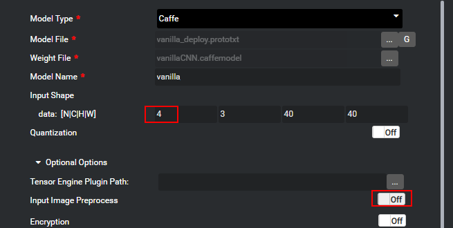
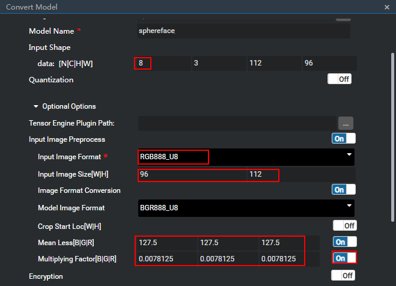
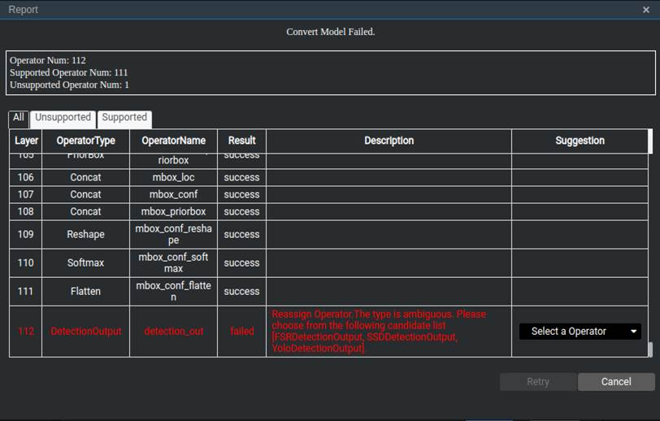
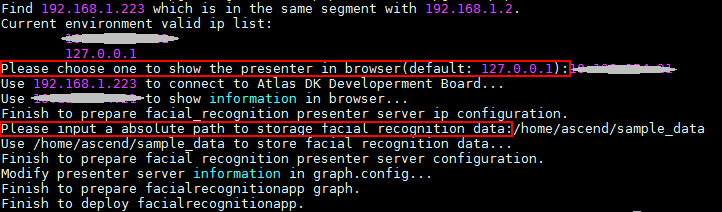
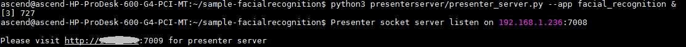

中文|[英文](README.md)

# 人脸识别<a name="ZH-CN_TOPIC_0185834698"></a>

开发者可以将本Application部署至Atlas 200 DK上实现人脸注册、并通过摄像头对视频中的人脸信息进行预测，与已注册的人脸进行比对，预测出最可能的用户。

## 前提条件<a name="zh-cn_topic_0182554631_section137245294533"></a>

部署此Sample前，需要准备好以下环境：

-   已完成Mind Studio的安装。
-   已完成Atlas 200 DK开发者板与Mind Studio的连接，交叉编译器的安装，SD卡的制作及基本信息的配置等。

## 软件准备<a name="zh-cn_topic_0182554631_section8534138124114"></a>

运行此Sample前，需要按照此章节获取源码包，并进行相关的环境配置。

1.  <a name="zh-cn_topic_0182554631_li953280133816"></a>获取源码包。

    将[https://gitee.com/Atlas200DK/sample-facialrecognition](https://gitee.com/Atlas200DK/sample-facialrecognition)仓中的代码以Mind Studio安装用户下载至Mind Studio所在Ubuntu服务器的任意目录，例如代码存放路径为：_/home/ascend/sample-facialrecognition_。

2.  获取此应用中所需要的原始网络模型。

    参考[表1](#zh-cn_topic_0182554631_table97791025517)获取此应用中所用到的原始网络模型及其对应的权重文件，并将其存放到Mind Studio所在Ubuntu服务器的任意目录，例如$HOME/ascend/models/facialrecognition。

    **表 1**  Facial Recognition中使用模型

    <a name="zh-cn_topic_0182554631_table97791025517"></a>
    <table><thead align="left"><tr id="zh-cn_topic_0182554631_row48791253115"><th class="cellrowborder" valign="top" width="13.309999999999999%" id="mcps1.2.4.1.1"><p id="zh-cn_topic_0182554631_p187902511114"><a name="zh-cn_topic_0182554631_p187902511114"></a><a name="zh-cn_topic_0182554631_p187902511114"></a>模型名称</p>
    </th>
    <th class="cellrowborder" valign="top" width="12.04%" id="mcps1.2.4.1.2"><p id="zh-cn_topic_0182554631_p148791259118"><a name="zh-cn_topic_0182554631_p148791259118"></a><a name="zh-cn_topic_0182554631_p148791259118"></a>模型说明</p>
    </th>
    <th class="cellrowborder" valign="top" width="74.65%" id="mcps1.2.4.1.3"><p id="zh-cn_topic_0182554631_p987922511111"><a name="zh-cn_topic_0182554631_p987922511111"></a><a name="zh-cn_topic_0182554631_p987922511111"></a>模型下载路径</p>
    </th>
    </tr>
    </thead>
    <tbody><tr id="zh-cn_topic_0182554631_row38791825912"><td class="cellrowborder" valign="top" width="13.309999999999999%" headers="mcps1.2.4.1.1 "><p id="zh-cn_topic_0182554631_p0879152519115"><a name="zh-cn_topic_0182554631_p0879152519115"></a><a name="zh-cn_topic_0182554631_p0879152519115"></a>face_detection</p>
    </td>
    <td class="cellrowborder" valign="top" width="12.04%" headers="mcps1.2.4.1.2 "><p id="zh-cn_topic_0182554631_p9879112516111"><a name="zh-cn_topic_0182554631_p9879112516111"></a><a name="zh-cn_topic_0182554631_p9879112516111"></a>人脸检测网络模型。</p>
    <p id="zh-cn_topic_0182554631_p1087912253112"><a name="zh-cn_topic_0182554631_p1087912253112"></a><a name="zh-cn_topic_0182554631_p1087912253112"></a>是基于Caffe的Resnet10-SSD300模型转换后的网络模型。</p>
    </td>
    <td class="cellrowborder" valign="top" width="74.65%" headers="mcps1.2.4.1.3 "><p id="zh-cn_topic_0182554631_p188801525813"><a name="zh-cn_topic_0182554631_p188801525813"></a><a name="zh-cn_topic_0182554631_p188801525813"></a>请参考<a href="https://gitee.com/HuaweiAscend/models/tree/master/computer_vision/object_detect/face_detection" target="_blank" rel="noopener noreferrer">https://gitee.com/HuaweiAscend/models/tree/master/computer_vision/object_detect/face_detection</a>目录中README.md下载原始网络模型文件及其对应的权重文件。</p>
    </td>
    </tr>
    <tr id="zh-cn_topic_0182554631_row11880162511114"><td class="cellrowborder" valign="top" width="13.309999999999999%" headers="mcps1.2.4.1.1 "><p id="zh-cn_topic_0182554631_p1388012251117"><a name="zh-cn_topic_0182554631_p1388012251117"></a><a name="zh-cn_topic_0182554631_p1388012251117"></a>vanillacnn</p>
    </td>
    <td class="cellrowborder" valign="top" width="12.04%" headers="mcps1.2.4.1.2 "><p id="zh-cn_topic_0182554631_p1988018251110"><a name="zh-cn_topic_0182554631_p1988018251110"></a><a name="zh-cn_topic_0182554631_p1988018251110"></a>人脸特征点标记网络模型。</p>
    <p id="zh-cn_topic_0182554631_p588013251514"><a name="zh-cn_topic_0182554631_p588013251514"></a><a name="zh-cn_topic_0182554631_p588013251514"></a>是基于Caffe的VanillaCNN模型转换后的网络模型。</p>
    </td>
    <td class="cellrowborder" valign="top" width="74.65%" headers="mcps1.2.4.1.3 "><p id="zh-cn_topic_0182554631_p28801025319"><a name="zh-cn_topic_0182554631_p28801025319"></a><a name="zh-cn_topic_0182554631_p28801025319"></a>请参考<a href="https://gitee.com/HuaweiAscend/models/tree/master/computer_vision/classification/vanillacnn" target="_blank" rel="noopener noreferrer">https://gitee.com/HuaweiAscend/models/tree/master/computer_vision/classification/vanillacnn</a><span>目录中</span>README.md下载原始网络模型文件及其对应的权重文件。</p>
    </td>
    </tr>
    <tr id="zh-cn_topic_0182554631_row988092511120"><td class="cellrowborder" valign="top" width="13.309999999999999%" headers="mcps1.2.4.1.1 "><p id="zh-cn_topic_0182554631_p108806251513"><a name="zh-cn_topic_0182554631_p108806251513"></a><a name="zh-cn_topic_0182554631_p108806251513"></a>sphereface</p>
    </td>
    <td class="cellrowborder" valign="top" width="12.04%" headers="mcps1.2.4.1.2 "><p id="zh-cn_topic_0182554631_p68802251019"><a name="zh-cn_topic_0182554631_p68802251019"></a><a name="zh-cn_topic_0182554631_p68802251019"></a>特征向量获取网络模型。</p>
    <p id="zh-cn_topic_0182554631_p148801125512"><a name="zh-cn_topic_0182554631_p148801125512"></a><a name="zh-cn_topic_0182554631_p148801125512"></a>是基于Caffe的SphereFace模型转换后的网络模型</p>
    </td>
    <td class="cellrowborder" valign="top" width="74.65%" headers="mcps1.2.4.1.3 "><p id="zh-cn_topic_0182554631_p128806251116"><a name="zh-cn_topic_0182554631_p128806251116"></a><a name="zh-cn_topic_0182554631_p128806251116"></a>请参考<a href="https://gitee.com/HuaweiAscend/models/tree/master/computer_vision/classification/sphereface" target="_blank" rel="noopener noreferrer">https://gitee.com/HuaweiAscend/models/tree/master/computer_vision/classification/sphereface</a><span>目录中</span>README.md下载原始网络模型文件及其对应的权重文件。</p>
    </td>
    </tr>
    </tbody>
    </table>

3.  将原始网络模型转换为Davinci模型。
    1.  在Mind Studio操作界面的顶部菜单栏中选择“Tool \> Convert Model”，进入模型转换界面。
    2.  在弹出的Convert Model操作界面中，Model File与Weight File分别选择步骤 2中下载的模型文件和权重文件。
        -   Model Name填写为[表1](#zh-cn_topic_0182554631_table97791025517)中对应的**模型名称**。
        -   参考[图1](#zh-cn_topic_0182554631_fig1513227955)和[图2](#zh-cn_topic_0182554631_fig61342716510)对vanillacnn和Sphereface模型进行模型转换配置。

            **图 1**  VanillaCNNModel模型转化配置参考<a name="zh-cn_topic_0182554631_fig1513227955"></a>  
            

            -   Input Shape中的N:4表示每次处理4张图片，此参数需要与“graph.config”中的对应模型的“batch\_size”的值保持一致。
            -   Input Image Preprocess：请设置为“off”。

            **图 2**  SpherefaceModel模型转化配置参考<a name="zh-cn_topic_0182554631_fig61342716510"></a>  
            

            -   Input Shape中的N:8表示人脸识别程序，每次处理8张人脸，此参数需要与“graph.config”中的对应模型的“batch\_size”的值保持一致。
            -   Input Image Format：输入图片的格式，此处选择RGB888\_U8。
            -   Input Image Size[W|H]：因为输入图片格式为RGB8888\_U8，此处不需要做128\*16对齐，直接使用模型要求的宽和高即可，即96与112。
            -   Mean Less[B|G|R]：此模型训练使用的图片的均值，可从此模型的sphereface\_model.prototxt文件中获取。
            -   Multiplying Factor[B|G|R]：此模型训练使用的图片的乘系数，可从此模型的sphereface\_model.prototxt文件中获取，即scale的值。


    3.  单击OK开始模型转换。

        face\_detection模型在转换的时候，会有报错。报错信息如下所示。

        **图 3**  模型转换错误<a name="zh-cn_topic_0182554631_fig1632884495219"></a>  
        

        此时在DetectionOutput层的Suggestion中选择SSDDetectionOutput，并点击Retry。

        模型转换成功后，后缀为.om的Davinci模型存放地址为$HOME/tools/che/model-zoo/my-model/xxx。


4.  将转换好的模型文件（.om文件）上传到[1](#zh-cn_topic_0182554631_li953280133816)中源码所在路径的“sample-facialrecognition/script”目录下。
5.  以Mind Studio安装用户登录Mind Studio所在Ubuntu服务器，并设置环境变量DDK\_HOME。

    **vim \~/.bashrc**

    执行如下命令在最后一行添加DDK\_HOME及LD\_LIBRARY\_PATH的环境变量。

    **export DDK\_HOME=/home/XXX/tools/che/ddk/ddk**

    **export LD\_LIBRARY\_PATH=$DDK\_HOME/uihost/lib**

    > **说明：**   
    >-   XXX为Mind Studio安装用户，/home/XXX/tools为DDK默认安装路径。  
    >-   如果此环境变量已经添加，则此步骤可跳过。  

    输入:wq!保存退出。

    执行如下命令使环境变量生效。

    **source \~/.bashrc**


## 部署<a name="zh-cn_topic_0182554631_section147911829155918"></a>

1.  以Mind Studio安装用户进入facialrecognition应用代码所在根目录，如/home/ascend/sample-facialrecognition。
2.  <a name="zh-cn_topic_0182554631_li08019112542"></a>执行部署脚本，进行工程环境准备，包括ascenddk公共库的编译与部署、Presenter Server服务器的配置等操作，其中Presenter Server用于接收Application发送过来的数据并通过浏览器进行结果展示。

    **bash deploy.sh** _host\_ip_ _model\_mode_

    -   _host\_ip_：Atlas 200 DK开发者板的IP地址。

    -   model\_mode代表模型文件及依赖软件的部署方式，默认为internet。
        -   local：若Mind Studio所在Ubuntu系统未连接网络，请使用local模式，执行此命令前，需要参考[公共代码库下载](#zh-cn_topic_0182554631_section158977311307)将依赖的代码库下载到“sample-facialrecognition/script“目录下。
        -   internet：若Mind Studio所在Ubuntu系统已连接网络，请使用internet模式，在线下载依赖代码库。


    命令示例：

    **bash deploy.sh 192.168.1.2 internet**

    -   当提示“Please choose one to show the presenter in browser\(default: 127.0.0.1\):“时，请输入在浏览器中访问Presenter Server服务所使用的IP地址（一般为访问Mind Studio的IP地址）。
    -   当提示“Please input a absolute path to storage facial recognition data:“时，请输入Mind Studio中存储人脸注册数据及解析数据，此路径Mind Studio用户需要有读写权限，如果此路径不存在，脚本会自动创建。

    如[图4](#zh-cn_topic_0182554631_fig184321447181017)所示，请在“Current environment valid ip list“中选择通过浏览器访问Presenter Server服务使用的IP地址，并输入存储人脸识别解析数据的路径。

    **图 4**  工程部署示意图<a name="zh-cn_topic_0182554631_fig184321447181017"></a>  
    

3.  启动Presenter Server。

    执行如下命令在后台启动Facial Recognition应用的Presenter Server主程序。

    **python3 presenterserver/presenter\_server.py --app facial\_recognition &**

    > **说明：**   
    >“presenter\_server.py“在当前目录的“presenterserver“目录下，可以在此目录下执行**python3 presenter\_server.py -h**或者**python3 presenter\_server.py --help**查看“presenter\_server.py“的使用方法。  

    如[图5](#zh-cn_topic_0182554631_fig69531305324)所示，表示presenter\_server的服务启动成功。

    **图 5**  Presenter Server进程启动<a name="zh-cn_topic_0182554631_fig69531305324"></a>  
    

    使用上图提示的URL登录Presenter Server，仅支持Chrome浏览器。IP地址为[2](#zh-cn_topic_0182554631_li08019112542)中输入的IP地址，端口号默为7009，如下图所示，表示Presenter Server启动成功。

    **图 6**  主页显示<a name="zh-cn_topic_0182554631_fig64391558352"></a>  
    

    Presenter Server、Mind Studio与Atlas 200 DK之间通信使用的IP地址示例如下图所示：

    **图 7**  IP地址示例<a name="zh-cn_topic_0182554631_fig1881532172010"></a>  
    

    其中：

    -   Atlas 200 DK开发者板使用的IP地址为192.168.1.2（USB方式连接）。
    -   Presenter Server与Atlas 200 DK通信的IP地址为UI Host服务器中与Atlas 200 DK在同一网段的IP地址，例如：192.168.1.223。
    -   通过浏览器访问Presenter Server的IP地址本示例为：10.10.0.1，由于Presenter Server与Mind Studio部署在同一服务器，此IP地址也为通过浏览器访问Mind Studio的IP。


## 运行<a name="zh-cn_topic_0182554631_section1676879104"></a>

1.  运行Facial Recognition程序。

    在“sample-facialrecognition“目录下执行如下命令运行Facial Recognition应用程序。

    **bash run\_facialrecognitionapp.sh** _host\_ip_ _presenter\_view\_app\_name  camera\_channel\_name_   &

    -   _host\_ip_：对于Atlas 200 DK开发者板，即为开发者板的IP地址。
    -   _presenter\_view\_app\_name_：用户自定义的在Presenter Server界面展示的App Name，此Name需要在Presenter Server展示界面唯一，只能是大小写字母、数字、“_”的组合，位数3-20。
    -   _camera\_channel\_name_：摄像头所属Channel，取值为“Channel-1“或者“Channel-2“，查询摄像头所属Channel的方法请参考[Atlas 200 DK使用指南](https://ascend.huawei.com/documentation)中的“如何查看摄像头所属Channel”。

    命令示例：

    **bash run\_facialrecognitionapp.sh 192.168.1.2 video Channel-1 &**

2.  使用启动Presenter Server服务时提示的URL登录 Presenter Server 网站，仅支持Chrome浏览器。

    Presenter Server展示界面如[图8](#zh-cn_topic_0182554631_fig1189774382115)所示。

    **图 8**  Presenter Server界面<a name="zh-cn_topic_0182554631_fig1189774382115"></a>  
    

    > **说明：**   
    >-   Facial Recognition的Presenter Server最多支持2路Channel同时显示，每个  _presenter\_view\_app\_name_  对应一路Channel。  
    >-   由于硬件的限制，每一路支持的最大帧率是20fps，受限于网络带宽的影响，帧率会自动适配较低的帧率进行显示。  

3.  进行人脸注册。
    1.  点击“Face Library“页签，在界面中输入“Username“。

        

    2.  单击“Browse“按钮，上传人脸图像，人脸图像裁剪时尽量按照“Example Photo“的比例设置。

    1.  点击Submit按钮上传若上传失败，可以更改裁剪比例。

4.  人脸识别以及比对。

    进入“App List“页签，在界面中点击对应的“App Name“，例如  _video_  ，若有人脸出现在摄像头中，且与已注册人脸匹配一致，则会出现对应人员姓名及相似度的标注。


## 后续处理<a name="zh-cn_topic_0182554631_section1092612277429"></a>

-   **停止人脸识别应用**

    Facial Recognition应用执行后会处于持续运行状态，若要停止Facial Recognition应用程序，可执行如下操作。

    以Mind Studio安装用户在“sample-facialrecognition“目录下执行如下命令：

    **bash stop\_facialrecognitionapp.sh** _host\_ip_

    _host\_ip_：对于Atlas 200 DK开发者板，即为开发者板的IP地址。。

    命令示例：

    **bash stop\_facialrecognitionapp.sh 192.168.1.2**

-   **停止Presenter Server服务**

    Presenter Server服务启动后会一直处于运行状态，若想停止人脸识别应用对应的Presenter Server服务，可执行如下操作。

    以Mind Studio安装用户在Mind Studio所在服务器中执行如下命令查看人脸识别应用对应的Presenter Server服务的进程。

    **ps -ef | grep presenter | grep facial\_recognition**

    ```
    ascend@ascend-HP-ProDesk-600-G4-PCI-MT:~/sample-facialrecognition$ ps -ef | grep presenter | grep facial_recognition
    ascend 22294 20313 22 14:45 pts/24?? 00:00:01 python3 presenterserver/presenter_server.py --app facial_recognition
    ```

    如上所示  _22294_  即为人脸识别应用对应的Presenter Server服务的进程ID。

    若想停止此服务，执行如下命令：

    **kill -9** _22294_


## 公共代码库下载<a name="zh-cn_topic_0182554631_section158977311307"></a>

将依赖的软件库下载到“/sample-facialrecognition/script“目录下。

**表 2**  依赖代码库下载

<a name="zh-cn_topic_0182554631_table1271020412443"></a>
<table><thead align="left"><tr id="zh-cn_topic_0182554631_row13710144154411"><th class="cellrowborder" valign="top" width="33.33333333333333%" id="mcps1.2.4.1.1"><p id="zh-cn_topic_0182554631_p1371014419447"><a name="zh-cn_topic_0182554631_p1371014419447"></a><a name="zh-cn_topic_0182554631_p1371014419447"></a>模块名称</p>
</th>
<th class="cellrowborder" valign="top" width="33.33333333333333%" id="mcps1.2.4.1.2"><p id="zh-cn_topic_0182554631_p207101347444"><a name="zh-cn_topic_0182554631_p207101347444"></a><a name="zh-cn_topic_0182554631_p207101347444"></a>模块描述</p>
</th>
<th class="cellrowborder" valign="top" width="33.33333333333333%" id="mcps1.2.4.1.3"><p id="zh-cn_topic_0182554631_p871019424412"><a name="zh-cn_topic_0182554631_p871019424412"></a><a name="zh-cn_topic_0182554631_p871019424412"></a>下载地址</p>
</th>
</tr>
</thead>
<tbody><tr id="zh-cn_topic_0182554631_row971014444418"><td class="cellrowborder" valign="top" width="33.33333333333333%" headers="mcps1.2.4.1.1 "><p id="zh-cn_topic_0182554631_p11710548449"><a name="zh-cn_topic_0182554631_p11710548449"></a><a name="zh-cn_topic_0182554631_p11710548449"></a>EZDVPP</p>
</td>
<td class="cellrowborder" valign="top" width="33.33333333333333%" headers="mcps1.2.4.1.2 "><p id="zh-cn_topic_0182554631_p1771117413440"><a name="zh-cn_topic_0182554631_p1771117413440"></a><a name="zh-cn_topic_0182554631_p1771117413440"></a>对DVPP接口进行了封装，提供对图片/视频的处理能力。</p>
</td>
<td class="cellrowborder" valign="top" width="33.33333333333333%" headers="mcps1.2.4.1.3 "><p id="zh-cn_topic_0182554631_p17112404416"><a name="zh-cn_topic_0182554631_p17112404416"></a><a name="zh-cn_topic_0182554631_p17112404416"></a><a href="https://gitee.com/Atlas200DK/sdk-ezdvpp" target="_blank" rel="noopener noreferrer">https://gitee.com/Atlas200DK/sdk-ezdvpp</a></p>
<p id="zh-cn_topic_0182554631_p8711344441"><a name="zh-cn_topic_0182554631_p8711344441"></a><a name="zh-cn_topic_0182554631_p8711344441"></a>下载后请保持文件夹名称为ezdvpp。</p>
</td>
</tr>
<tr id="zh-cn_topic_0182554631_row5711846445"><td class="cellrowborder" valign="top" width="33.33333333333333%" headers="mcps1.2.4.1.1 "><p id="zh-cn_topic_0182554631_p1171111418446"><a name="zh-cn_topic_0182554631_p1171111418446"></a><a name="zh-cn_topic_0182554631_p1171111418446"></a>Presenter Agent</p>
</td>
<td class="cellrowborder" valign="top" width="33.33333333333333%" headers="mcps1.2.4.1.2 "><p id="zh-cn_topic_0182554631_p4711441449"><a name="zh-cn_topic_0182554631_p4711441449"></a><a name="zh-cn_topic_0182554631_p4711441449"></a>与Presenter Server进行交互的API接口。</p>
</td>
<td class="cellrowborder" valign="top" width="33.33333333333333%" headers="mcps1.2.4.1.3 "><p id="zh-cn_topic_0182554631_p15711144204416"><a name="zh-cn_topic_0182554631_p15711144204416"></a><a name="zh-cn_topic_0182554631_p15711144204416"></a><a href="https://gitee.com/Atlas200DK/sdk-presenter/tree/master" target="_blank" rel="noopener noreferrer">https://gitee.com/Atlas200DK/sdk-presenter/tree/master</a></p>
<p id="zh-cn_topic_0182554631_p11711548443"><a name="zh-cn_topic_0182554631_p11711548443"></a><a name="zh-cn_topic_0182554631_p11711548443"></a>请获取此路径下的presenteragent文件夹，下载后请保持文件夹名称为presenteragent。</p>
</td>
</tr>
<tr id="zh-cn_topic_0182554631_row771184174413"><td class="cellrowborder" valign="top" width="33.33333333333333%" headers="mcps1.2.4.1.1 "><p id="zh-cn_topic_0182554631_p27112434415"><a name="zh-cn_topic_0182554631_p27112434415"></a><a name="zh-cn_topic_0182554631_p27112434415"></a>tornado (5.1.0)</p>
<p id="zh-cn_topic_0182554631_p17113484416"><a name="zh-cn_topic_0182554631_p17113484416"></a><a name="zh-cn_topic_0182554631_p17113484416"></a>protobuf (3.5.1)</p>
<p id="zh-cn_topic_0182554631_p15711848444"><a name="zh-cn_topic_0182554631_p15711848444"></a><a name="zh-cn_topic_0182554631_p15711848444"></a>numpy (1.14.2)</p>
</td>
<td class="cellrowborder" valign="top" width="33.33333333333333%" headers="mcps1.2.4.1.2 "><p id="zh-cn_topic_0182554631_p1771117415442"><a name="zh-cn_topic_0182554631_p1771117415442"></a><a name="zh-cn_topic_0182554631_p1771117415442"></a>Presenter Server依赖的Python库</p>
</td>
<td class="cellrowborder" valign="top" width="33.33333333333333%" headers="mcps1.2.4.1.3 "><p id="zh-cn_topic_0182554631_p9711542447"><a name="zh-cn_topic_0182554631_p9711542447"></a><a name="zh-cn_topic_0182554631_p9711542447"></a>可以在python官网<a href="https://pypi.org/" target="_blank" rel="noopener noreferrer">https://pypi.org/</a>上搜索相关包进行安装。</p>
<p id="zh-cn_topic_0182554631_p117111742441"><a name="zh-cn_topic_0182554631_p117111742441"></a><a name="zh-cn_topic_0182554631_p117111742441"></a>若使用pip3 install命令在线下载，可以使用如下命令指定相关版本进行下载，例如：</p>
<p id="zh-cn_topic_0182554631_p11712249444"><a name="zh-cn_topic_0182554631_p11712249444"></a><a name="zh-cn_topic_0182554631_p11712249444"></a>pip3 install tornado==5.1.0  -i  <em id="zh-cn_topic_0182554631_i471224104410"><a name="zh-cn_topic_0182554631_i471224104410"></a><a name="zh-cn_topic_0182554631_i471224104410"></a>指定库的安装源</em>  --trusted-host  <em id="zh-cn_topic_0182554631_i14712449449"><a name="zh-cn_topic_0182554631_i14712449449"></a><a name="zh-cn_topic_0182554631_i14712449449"></a>安装源的主机名</em></p>
</td>
</tr>
</tbody>
</table>

